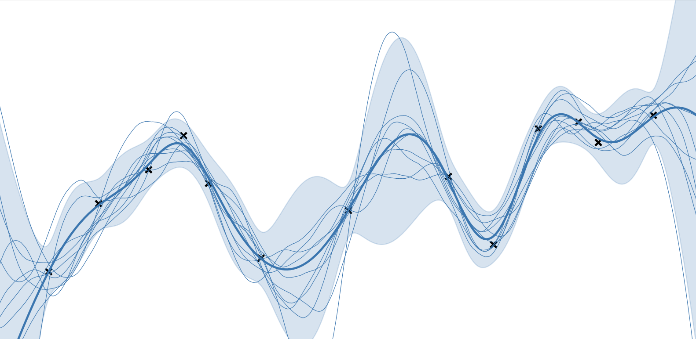
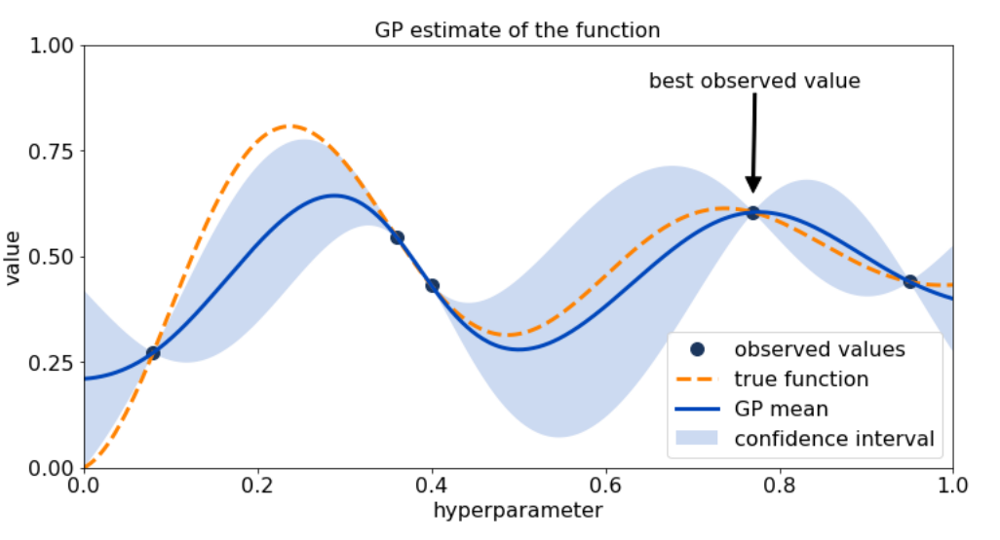

# Probabilistic-Artificial-Intelligence

## Gaussian Process Regression for ground-water pollution prediction
  
  <table>
  <tr>
    <td>
      This project consists in implementating a Gaussian Process regression applied on a real world inference problem (ground-water pollution prediction). The very large dataset yields computing problem which may be solved with the Nyström approximation of the kernel function.
    </td>
    <td>
      
    </td>
  </tr>
</table>

## Predicting uncertainty with Bayesian Neural Networks on MNIST dataset

 <table>
  <tr>
    <td>
      This project consists in implementing a Bayesian Neural Network, trained and tested on the Rotated MNIST and Fashion MNIST datasets, for class prediction with uncertainty. The training process minimizes a loss function which considers both a Cross-Entropy loss and a Kullback–Leibler divergence loss term. 
    </td>
    <td>
      
    </td>
  </tr>
</table>

## Hyperparameter tuning with constrained Bayesian optimization

<table>
  <tr>
    <td>
      This project is an implementation of a custom Bayesian optimization algorithm to an hyperparameter tuning problem. Upper Confidence Bound (UCB) method was deployed to implement the algorithm. 
    </td>
    <td>
      
    </td>
  </tr>
</table>

## Actor Critic Reinforcement Learning (LunarLander-v2 OpenAI Gym)

<table>
  <tr>
    <td>
      Implementation of a Deep Reinforcement Learning algorithm able to learn a control policy for a lander (spaceship), by practicing on a simulator. The project required the use of Actor-Critic methods with policy gradients, in particular Rewards-to-go and Generalized Advantage Estimatation methods, both aiming at decreasing the variance of the policy gradient estimates.
    </td>
    <td>
      
    </td>
  </tr>
</table>

